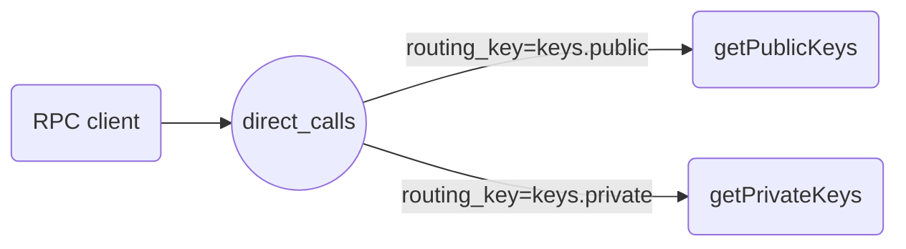

# Micro-servicio
Gestiona las llaves publica y privada de los usuarios

**Atención:** este microservicio solo se ejecuta correctamente en un contenedor de Docker tanto para desarrollo como para producción.

## RPC
### Servidor
```bash
nodejs src/keysRpcServer.js generate public private
```
### Cliente en NodeJS
Aunque el cliente debe estar en el MS de Sign y Verification desde acá lo podemos probar
```bash
user_id=$RANDOM
nodejs src/keysRpcClient.js generate $user_id
nodejs src/keysRpcClient.js generate $user_id
nodejs src/keysRpcClient.js private $user_id
nodejs src/keysRpcClient.js public $user_id
```
### Exchanges y `routing_key`
Los exchanges o intercambiadores permiten redirigir los mensajes a diferentes colas basados en `routing_key` (mes info en [
Publish/Subscribe tutorial](https://www.rabbitmq.com/tutorials/tutorial-three-javascript.html))



## Testing
### Jest
```bash
npx jest
npx jest -i KeysDao.test.js -t insertData
npx jest -i controller.test.js
npx jest -i controller.test.js -t generateKeys
npx jest -i controller.test.js -t getPrivateKey
```
