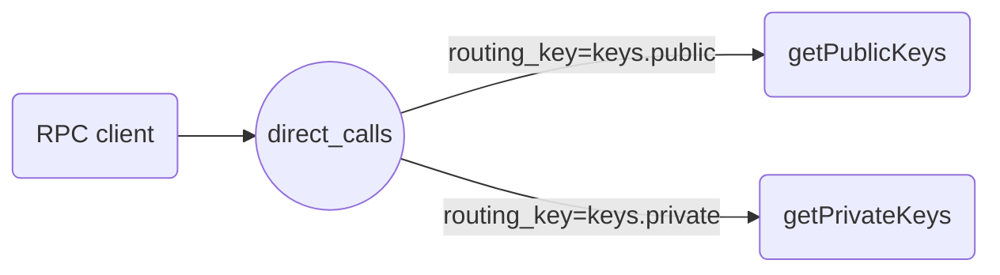

# Micro-servicio
Gestiona las llaves publica y privada de los usuarios

**Atención:** este microservicio solo se ejecuta correctamente en un contenedor de Docker tanto para desarrollo como para producción.

## RPC

### Exchanges y `routing_key`
Los exchanges o intercambiadores permiten redirigir los mensajes a diferentes colas basados en `routing_key` (mes info en [
Publish/Subscribe tutorial](https://www.rabbitmq.com/tutorials/tutorial-three-javascript.html))



```bash
nodejs ./src/rpc_server.js
```

```bash
nodejs ./src/rpc_client.js 30
```

## Testing
Resolución correcta del nombre del dominio `host.docker.internal` para el host de docker 
```bash
ping host.docker.internal
```

Variables de entorno
```bash
nodejs ./tests/testDotEnv.js
```